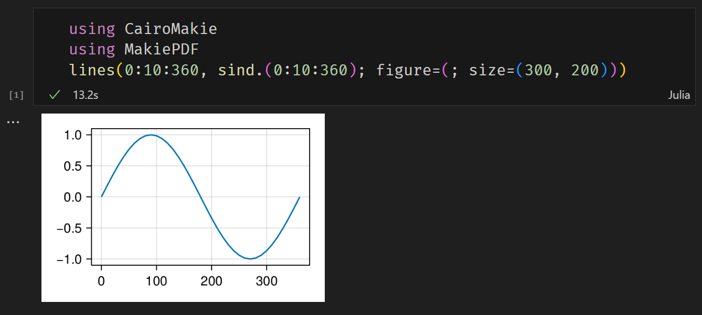

# MakiePDF

[](https://daizutabi.github.io/MakiePDF.jl/stable/)
[](https://daizutabi.github.io/MakiePDF.jl/dev/)
[](https://github.com/daizutabi/MakiePDF.jl/actions/workflows/CI.yml?query=branch%3Amain)
[](https://codecov.io/gh/daizutabi/MakiePDF.jl)
[](https://github.com/invenia/BlueStyle)
[](https://github.com/JuliaTesting/Aqua.jl)

MakiePDF is a simple package for embedding PDF images in Jupyter notebooks.

## Usage

In a Jupyter notebook (`plot.ipynb`), you can plot any figures with CairoMakie.



PNG images are displayed on screen, while PDF images are embedded in the notebook.

Then, PDF images can be extracted from the notebook and saved as image files.
For example,

```julia
using Base64
using JSON3

json_string = read("plot.ipynb", String)
nb = JSON3.read(json_string)
data = nb.cells[1].outputs[1].data["application/pdf"]

open("plot.pdf", "w") do f
    write(f, base64decode(data))
end
```

Saved images can be used in documentation processors such as Microsoft Word or LaTeX.
