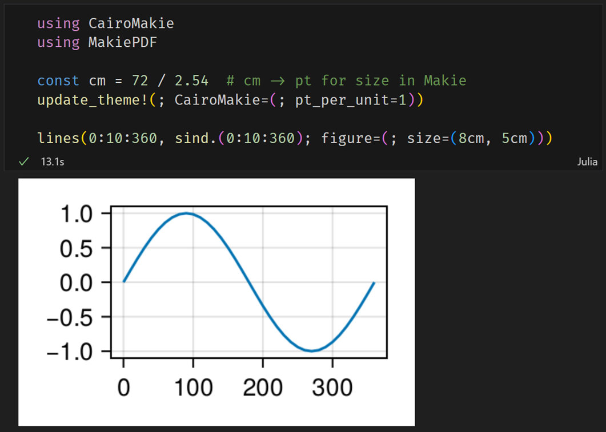

# MakiePDF

A simple package for embedding PDF images in Jupyter notebooks.

[![Stable][docs-stable-img]][docs-stable-url]
[![Dev][docs-dev-img]][docs-dev-url]
[![Build Status][GHA-img]][GHA-url]
[![Coverage][codecov-img]][codecov-url]
[![PkgEval][pkgeval-img]][pkgeval-url]
[![Code Style: Blue][codestyle-blue-img]][codestyle-blue-url]
[![Aqua][aqua-img]][aqua-url]

## Usage

In a Jupyter notebook (`plot.ipynb`), you can plot figures with CairoMakie.



PNG images are displayed on screen, while PDF images are embedded in the notebook.

Then, PDF images can be extracted from the notebook and saved as image files.
For example,

```
using Base64
using JSON3

json_string = read("plot.ipynb", String)
nb = JSON3.read(json_string)
data = nb.cells[1].outputs[1].data["application/pdf"]

open("plot.pdf", "w") do f
    write(f, base64decode(data))
end
```

Saved images can be used in documentation processors such as LaTeX or Microsoft Word.

[docs-dev-img]: https://img.shields.io/badge/docs-dev-blue.svg
[docs-dev-url]: https://daizutabi.github.io/MakiePDF.jl/dev/

[docs-stable-img]: https://img.shields.io/badge/docs-stable-blue.svg
[docs-stable-url]: https://daizutabi.github.io/MakiePDF.jl/stable/

[GHA-img]: https://github.com/daizutabi/MakiePDF.jl/actions/workflows/CI.yml/badge.svg?branch=main
[GHA-url]: https://github.com/daizutabi/MakiePDF.jl/actions/workflows/CI.yml?query=branch%3Amain

[codecov-img]: https://codecov.io/gh/daizutabi/MakiePDF.jl/branch/main/graph/badge.svg
[codecov-url]: https://codecov.io/gh/daizutabi/MakiePDF.jl

[pkgeval-img]: https://juliaci.github.io/NanosoldierReports/pkgeval_badges/M/MakiePDF.svg
[pkgeval-url]: https://juliaci.github.io/NanosoldierReports/pkgeval_badges/M/MakiePDF.html

[codestyle-blue-img]: https://img.shields.io/badge/code%20style-blue-4495d1.svg
[codestyle-blue-url]: https://github.com/invenia/BlueStyle

[aqua-img]: https://raw.githubusercontent.com/JuliaTesting/Aqua.jl/master/badge.svg
[aqua-url]: https://github.com/JuliaTesting/Aqua.jl
